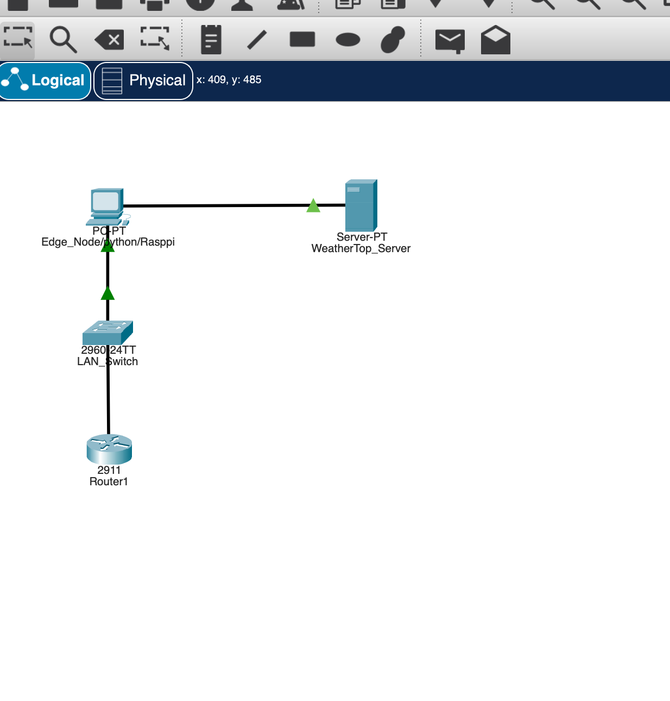
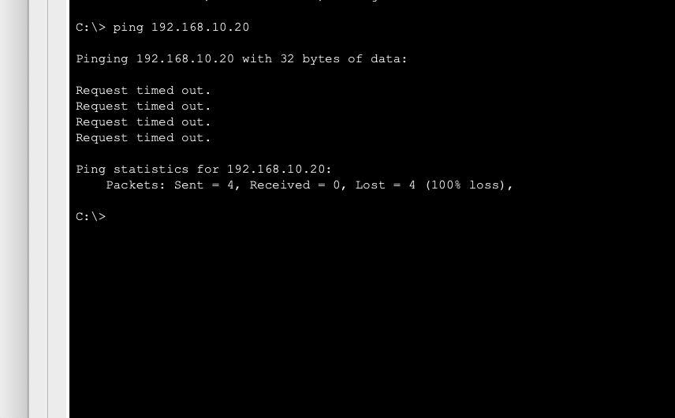
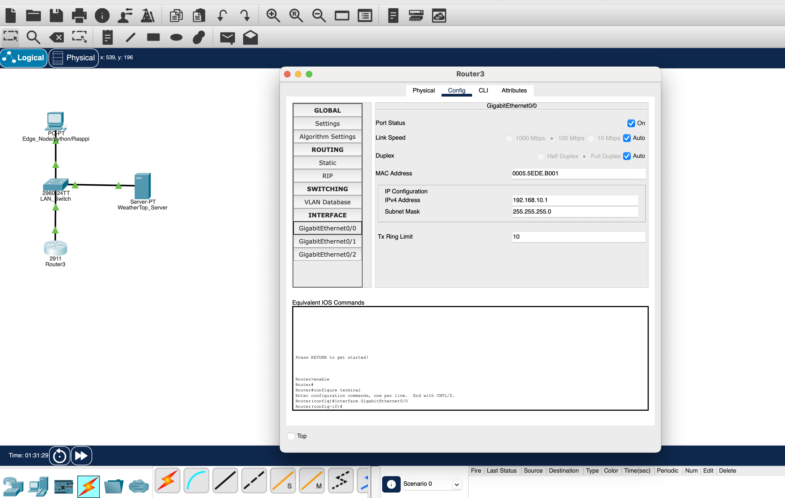
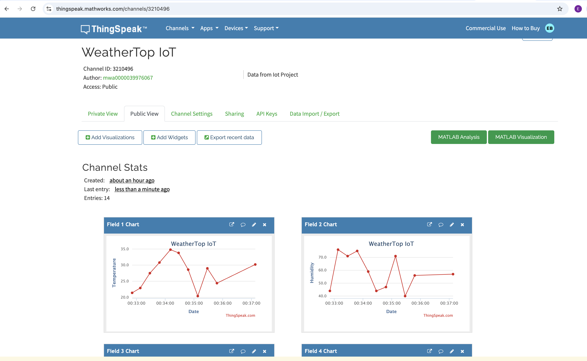
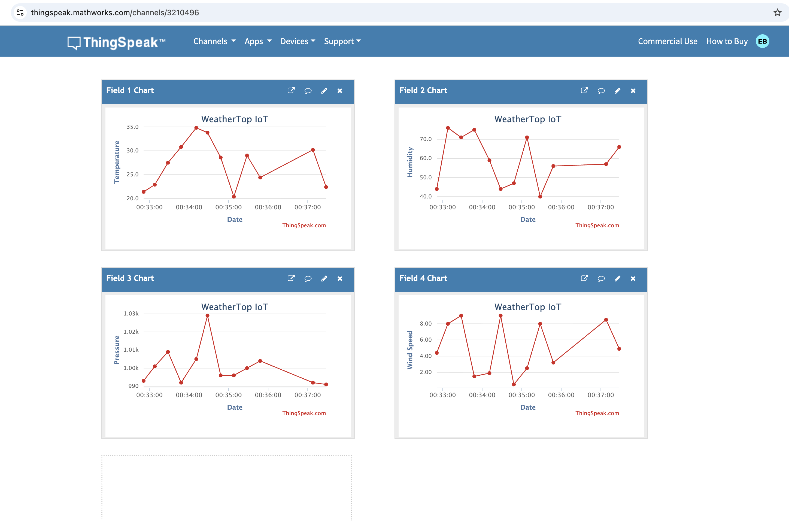

# Packet Tracer Network Simulation  
**WeatherTop-IoT**

## Purpose of the Simulation

This document describes the Cisco Packet Tracer simulation created to model the
network infrastructure supporting the WeatherTop-IoT system.

The purpose of this simulation is to demonstrate **core computer networking
principles**—including addressing, switching, routing, encapsulation, and
layered communication—rather than to execute application-level IoT logic inside
Packet Tracer.

Packet Tracer is used as a **conceptual and educational tool** to visualise how
data produced by IoT devices can traverse a network from edge to backend systems.

---

## Simulated Topology

The Packet Tracer topology consists of the following components:

- **Edge Node (PC)**  
  Represents the simulated Raspberry Pi running the Python IoT edge node.

- **LAN Switch (Cisco 2960)**  
  Represents **Layer 2 switching**, including frame forwarding and ARP-based
  MAC address resolution within the local network.

- **Router (Cisco 2911)**  
  Represents **Layer 3 routing** and acts as the default gateway for the subnet.

- **Backend Server (PC)**  
  Represents the WeatherTop Node.js backend that subscribes to MQTT messages,
  processes telemetry, and forwards data to cloud services.

All devices are connected within a private IPv4 local area network (LAN) and
configured using static IP addressing.

### Packet Tracer Topology Diagram

---

## IP Addressing and Subnetting

The following addressing scheme is used:

| Device | IP Address | Subnet Mask |
|------|-----------|-------------|
| Edge Node | 192.168.10.10 | 255.255.255.0 |
| Backend Server | 192.168.10.20 | 255.255.255.0 |
| Router (Gateway) | 192.168.10.1 | 255.255.255.0 |

All devices are part of the same `/24` subnet (`192.168.10.0/24`).

Static IP addressing is used to simplify demonstration, ensure predictability,
and make troubleshooting more transparent.

---

## Connectivity Verification

End-to-end connectivity is verified using **ICMP echo requests (ping)** from the
edge node to the backend server.

Successful ping responses confirm correct operation across multiple OSI layers:

- **Layer 1 (Physical):** Cabling and interface status  
- **Layer 2 (Data Link):** Switching and ARP resolution  
- **Layer 3 (Network):** IP addressing and routing  

### ICMP Test Evidence

---

## Router Configuration

The router is configured with a static IP address and functions as the default
gateway for all devices on the subnet. This enables IP routing and demonstrates
Layer 3 forwarding.

### Router Configuration Evidence

---

## OSI Layer Mapping (Conceptual)

The simulation maps directly to the layered networking model used by the real
WeatherTop-IoT system:

| OSI Layer | Implementation |
|---------|----------------|
| Layer 1 | Ethernet cabling (Packet Tracer) |
| Layer 2 | Switching, MAC addressing, ARP |
| Layer 3 | IP addressing and routing |
| Layer 4 | TCP (conceptual, not simulated) |
| Layer 7 | MQTT and HTTP (implemented in live application) |

Packet Tracer demonstrates the **lower-layer network foundation**, while
application-layer protocols are implemented and observed in the running system.

---

## Mapping to the Real WeatherTop-IoT System

In the real WeatherTop-IoT implementation:

- The **edge node**, **MQTT broker**, and **backend server** may reside on different
  physical or logical networks.
- **Switches and routers** perform the same forwarding and routing roles as shown
  in the Packet Tracer simulation.
- Application-layer protocols such as **MQTT** and **HTTP** operate on top of
  **TCP/IP**, independent of the underlying hardware and topology.

This Packet Tracer simulation therefore demonstrates the **network infrastructure
required** for the WeatherTop-IoT system to function correctly, even though the
actual MQTT messaging and persistence occur outside Packet Tracer.

---

## Cloud Integration Evidence (ThingSpeak)

The WeatherTop backend forwards telemetry data to the **ThingSpeak cloud platform**
using HTTP requests. This enables real-time cloud-based visualisation of IoT data.

### ThingSpeak Evidence Screenshots

These screenshots confirm successful cloud integration and real-time telemetry
visualisation, complementing the local CSV persistence and web-based IoT dashboard.

---

## Notes

- Cisco Packet Tracer is used **solely** to model and validate networking concepts.
- IoT data generation, MQTT communication, event-driven logic, cloud integration,
  and persistence are implemented in the live WeatherTop-IoT application.
- This separation reflects real-world IoT system design.

---

## Files Included

- `docs/network/weather-top-iot-networking.pkt`
- `docs/network/packet-tracer.md`
- `docs/network/screenshots/Topology.png`
- `docs/network/screenshots/ping-edge-to-server.png`
- `docs/network/screenshots/Router-confg.png`
- `docs/network/screenshots/ThingSpeakEvidence.png`
- `docs/network/screenshots/ThingSpeakEvidence2.png`

